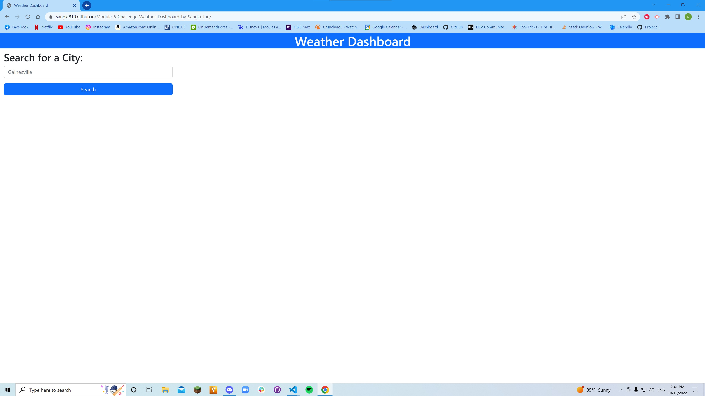

# Module 6 Challenge: Weather Dashboard by Sangki Jun
## Description
This is the completed module 6 challenge from the UCF FSF Bootcamp. The purpose of this site was for the creator to practice using APi's to create a functioning site. There was some codes and pseudo codes given by the program but the site was mostly completed from scratch.
## Installations
N/A
## Usage
This functions as a weather dashboard for any city that is looked up within the search bar. The site displays the current day's weather for the city as well as a 5-day forecast for the future. The data displayed for the weather is temperature, wind speed, humidity level, and clouds conditions.
## Credits
A huge shoutout to Youssef Ojeil, Mateo Wallace, and Tristan Ballin for posting their repositories! It helped me understand how to figure out my own site.
## License
N/A
## Links and Screenshot
https://sangki810.github.io/Module-6-Challenge-Weather-Dashboard-by-Sangki-Jun/ 
